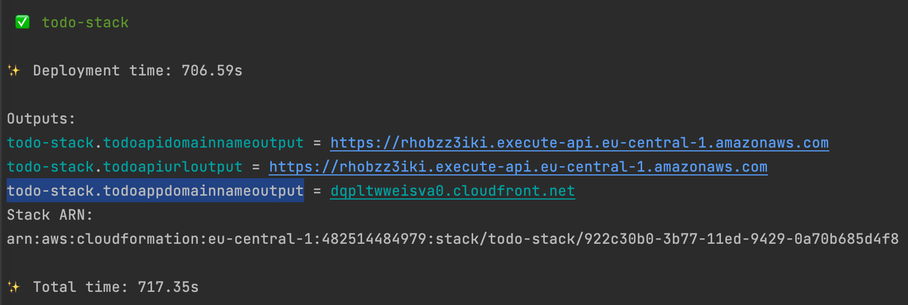
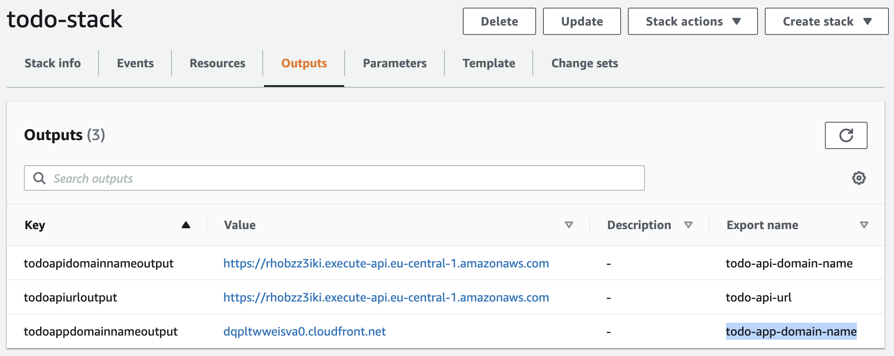

# MerLoc Demo TODO App - Infrastructure


This is a [Maven](https://maven.apache.org/) based [AWS CDK](https://github.com/aws/aws-cdk) project 
to setup a sample 100% serverless TODO application with [MerLoc](https://github.com/thundra-io/merloc) support
to be able to develop, test, debug and hot-reload AWS Lambda functions locally.

## Prerequisites
- Java 8+
- AWS CDK 1.x/2.x

## Setup

To start the AWS CDK deploy, you just need to run the deploy script in the root folder here:
```
./deploy.sh
```

- If you want to configure the region to deploy the TODO application infrastructure, 
you can specify it by `AWS_REGION` environment variable.
For example to deploy the application into `eu-central-1` region:
```
AWS_REGION=eu-central-1 ./deploy.sh
```

- If you want to specify the AWS profile to deploy the TODO application infrastructure,
  you can specify it by `AWS_PROFILE` environment variable.
  For example to deploy the application through `personal` AWS profile:
```
AWS_PROFILE=personal ./deploy.sh
```

After deploy, to be able to access the deployed TODO application,

- either you can get TODO application domain name from the AWS CDK outputs (`todo-stack.todoappdomainnameoutput`), for ex:


- or from the AWS CloudFormation output (export name `todo-app-domain-name`), for ex:


## Configuration

You can pass the additional configurations through environment variables to the AWS CDK application 
for the infrastructure setup.

### Custom Domain Name

If you want to use custom domain name for your TODO application,
(instead of the generated AWS CloudFront and API Gateway endpoint URL), 
you need to create an **AWS Hosted Zone** and pass the root domain name of the target **AWS Hosted Zone**
through `TODO_DOMAIN_NAME` environment variable to the AWS CDK application (deploy script mentioned above):

After configuring that setting, your TODO application's full custom domain name will be `app.todo.${TODO_DOMAIN_NAME}` 
and you will be able to access it through `https://app.todo.${TODO_DOMAIN_NAME}`.

So let's say that you have an AWS hosted zone with domain name `johndoe.com`. 
Then you set `TODO_DOMAIN_NAME` to `johndoe.com`. 
So your TODO application's full custom domain name will be `app.todo.johndoe.com` and 
you can access it through `https://app.todo.johndoe.com`.

## Useful Commands

 * `mvn package`     compile and run tests
 * `cdk ls`          list all stacks in the app
 * `cdk synth`       emits the synthesized AWS CloudFormation template
 * `cdk deploy`      deploy this stack to your default AWS account/region
 * `cdk diff`        compare deployed stack with current state
 * `cdk docs`        open AWS CDK documentation

## Contributing

Everyone is very welcome to contribute to this repository.
Feel free to [raise issues](https://github.com/thundra-io/merloc-demo-java/issues)
or to [submit Pull Requests](https://github.com/thundra-io/merloc-demo-java/pulls).

## License

Licensed under [Apache License 2.0](LICENSE).
